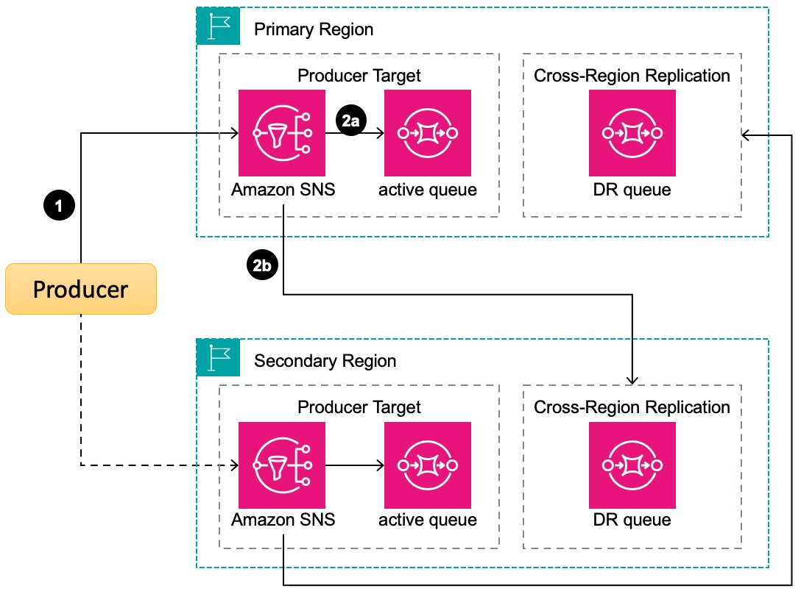

# SQS Multi-Region: SNS Fan-Out Pattern

Amazon Simple Queue Service (SQS) is widely adopted by organizations for its ability to reliably decouple microservices, process event-driven applications, and handle high-volume message delivery without infrastructure management overhead. As businesses face increasing demands for 24/7 availability and regulatory requirements for geographic redundancy, many are exploring multi-region architectures to enhance their messaging systems' resilience against regional outages. To address this need, Amazon SNS's cross-region delivery capabilities allow messages to be sent to SQS queues in different regions, enabling customers to implement robust, fault-tolerant messaging architectures that span multiple AWS regions, thus ensuring business continuity and maintaining message integrity even during localized disruptions.



## Deployment Instructions
1. Create a new directory, navigate to that directory in a terminal and clone the GitHub repository:
    ```
    git clone https://github.com/marcosortiz/sns-sqs-multi-region.git
    ```
1. Change directory to:
    ```
    cd sns-sqs-multi-region
    ```
1. From the command line, use AWS SAM to deploy the AWS resources for the stack as specified in the template.yml file on the primary Region:
    ```
    sam deploy --guided --config-env primary
    ```
1. During the prompts:
    * **Stack Name:** Enter a stack name.
    * **AWS Region:** Enter the desired primary AWS Region. This stack has been tested with both us-east-1 and us-east-2.
    * Allow SAM CLI to create IAM roles with the required permissions.
    * Allow SAM CLI to create the Service1LambdaRegionalApi Lambda function.
    * **SAM configuration environment** Accept the **primary** default value.

    Once you have run `sam deploy --guided --config-env primary` mode once and saved arguments to a configuration file (samconfig.toml), you can use `sam deploy --config-env primary` in future to use these defaults.

1. From the command line, use AWS SAM to deploy the AWS resources for the stack as specified in the template.yml file on the primary Region:
    ```
    sam deploy --guided --config-env secondary --output-file config/secondary.json
    ```
1. During the prompts:
    * **Stack Name:** Enter a stack name.
    * **AWS Region:** Enter the desired secondary AWS Region. This stack has been tested with both us-east-1 and us-east-2. **Make sure to use a different Region from the primary one**.
    * Allow SAM CLI to create IAM roles with the required permissions.
    * Allow SAM CLI to create the Service1LambdaRegionalApi Lambda function.
    * **SAM configuration environment** Accept the **primary** default value.

    Once you have run `sam deploy --guided --config-env secondary` mode once and saved arguments to a configuration file (samconfig.toml), you can use `sam deploy --config-env secondary` in future to use these defaults.
    
1. Note the outputs from the SAM deployment process. These contain details which are used for testing.

## How it works

This stack will deploy an Amazon API Gateway Rest Regional API with a Lambda integration. The AWS Lambda function is written in Python3.9. The function returns a small message with the service name and the Region it is deployed at. The inline code of the lambda is written in the template itself.

## Testing

WIP

## Cleanup
 
1. Delete the stack on the primary Region.
    ```bash
    sam delete --config-env primary
    ```
1. Delete the stack on the secondary Region.
    ```bash
    sam delete --config-env secondary
    ```

## Consumer Dashboard
This dashboard display the consumer latency, both on the primary and secondary region.


We use the following attributes to calculate messag elatencies:
Attribute|Source| Description
----|------|-----
recorded_at | Producer |The time the message was created by the producer. The format is the number of milliseconds since the [Epoch](https://en.wikipedia.org/wiki/Epoch_(computing)).|
Timestamp | SNS |The time when the message was received by SNS. [Learn more](https://docs.aws.amazon.com/sns/latest/dg/sns-sqs-as-subscriber.html)|
SentTimestamp | SQS |The time the message was successfully added to the queue (epoch time in milliseconds) [Learn more](https://docs.aws.amazon.com/AWSSimpleQueueService/latest/APIReference/API_ReceiveMessage.html)|
ApproximateFirstReceiveTimestamp | SQS |The time the message was first received from the queue by a consumer.  [Learn more](https://docs.aws.amazon.com/AWSSimpleQueueService/latest/APIReference/API_ReceiveMessage.html)|


Notes:
- The timestamp field needs better documentation (meaning and format)


This is how the latencies are calculated:
Metric|Description| More details
----|------|-----
sns_to_sqs_latency | WIP | ApproximateFirstReceiveTimestamp - SentTimestamp |
sqs_to_lambda_latency | WIP| current_time - ApproximateFirstReceiveTimestamp |
consumer_latency | WIP | current_time - recorded_at |

Where current_time is the execution time when the Lambda function started processing the message.


----
Copyright 2023 Amazon.com, Inc. or its affiliates. All Rights Reserved.

SPDX-License-Identifier: MIT-0
